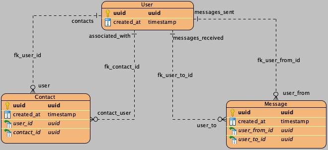

# instant-messaging app

## User stories
- [x] user wants to authenticate
- [x] user wants to send and recieve messages
- [x] user wants to see the message history
- [ ] user wants to receive notifications about new messages in telegram if user is offline
  
## Technical stack requirements
- FastAPI
- PostgresSQL
- SqlAlchemy (for both user and message models only in demo purposes, messages should be stored in key-value store such as Cassandra)
- Celery (notifications queue)
- Redis (session storage)
- Docker
- Nginx
  
## Work items
- [x] user authentication
- [x] send messages
- [x] receive messages
- [x] view message history
- [ ] offline notifications
    - when user connects, his status becomes online
    - when user disconnects, his status becomes offline
      - last_active_at timestamp is saved in db
    - you can query redis for sio to see who is online
    - chatbot and celery notification queue when offline
      - add telegram username to user model
- [ ] deployment
  - [ ] make app docker image
  - [ ] make nginx reverse-proxy service

## System design considerations
- Repository pattern
- Unit of work pattern
- Service classes handle business logic
  
## Prerequisites
- pnpm
  - `npm install -g pnpm`
- nodejs v22
- python v3.10
  
## Development and Test
```shell
cd backend && \
make docker.up.dev && \
make jwt.keys && \
make backend.dev && \
make backend.test && \
cd ../frontend && \
pnpm i && \
pnpm run dev
```

## Database ERD relationship model
shows actual ORM relationships only, all columns are not shown  


<details>
<summary>Requirements specification</summary>

**Цель:** Разработать простой сервис для обмена мгновенными сообщениями между пользователями в реальном времени.

## **📌 Задачи:**

1. **Регистрация и аутентификация пользователей:**  
   * Реализуй возможность регистрации новых пользователей.  
   * Обеспечь аутентификацию и авторизацию при работе с API.  
2. **Отправка и получение сообщений:**  
   * Пользователи могут отправлять сообщения друг другу.  
   * Реализуй получение новых сообщений в реальном времени.  
3. **Сохранение истории сообщений:**  
   * Все сообщения должны сохраняться в базе данных.  
   * Предусмотри возможность получения истории переписки между пользователями.  
4. **Уведомления через Telegram-бота:**  
   * Создай простого Telegram-бота с помощью Aiogram.  
   * Бот должен уведомлять пользователя о новом сообщении, если он офлайн.  
5. **Веб-интерфейс для тестирования:**  
   * Разработай простую веб\-страницу для взаимодействия с сервисом.  
   * Дизайн не важен — можешь использовать любые готовые шаблоны.  
   * Веб-интерфейс может быть реализован на любом языке и стеке по твоему выбору.

     ## **🛠 Технические требования:**

* **Язык программирования:** Python 3.10 или новее.  
* **Фреймворк:** FastAPI для разработки RESTful API.  
* **Асинхронность:**  
  * Используй `async`/`await` для обработки запросов.  
  * Реализуй реальное время с помощью WebSockets или другой технологии по твоему выбору.  
* **Многопоточность:**  
  * Используй многопоточность, где это необходимо для повышения производительности.  
* **Базы данных:**  
  * **PostgreSQL** для хранения пользователей и сообщений.  
  * **Redis** для кэширования и хранения сессий.  
* **ORM и миграции:**  
  * SQLAlchemy для работы с базой данных.  
  * Alembic для управления миграциями.  
* **Фоновые задачи:**  
  * Celery для обработки фоновых задач (например, отправка уведомлений через бота).  
* **Контейнеризация:**  
  * Docker для контейнеризации приложения.  
* **Сервер:**  
  * Nginx для обратного проксирования (можно использовать простой конфигурационный файл).

    ## **🎨 Веб-интерфейс:**

* Должен позволять:  
  * Регистрироваться и входить в систему.  
  * Отправлять и получать сообщения.  
* **Не трать много времени на дизайн.**  
* Можешь использовать любые фреймворки или даже простую HTML-страницу.  
* Готовые шаблоны и библиотеки приветствуются.
</details>